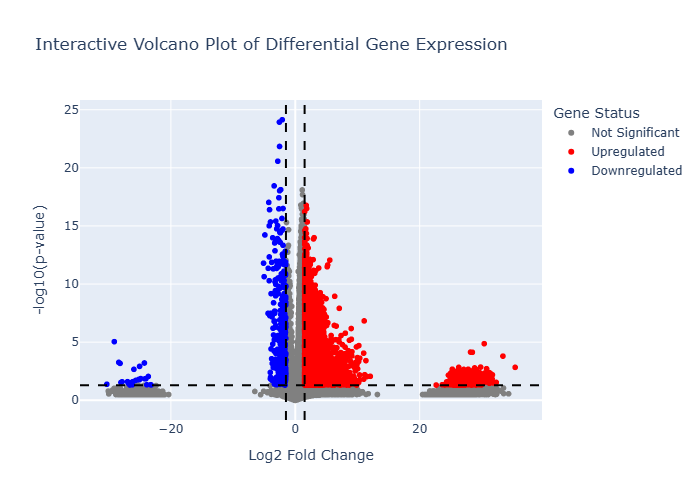

# Gene Experession Visualisation

This project performs differential gene expression analysis, between healthy and tumour tissue, then visualises the results using an interactive volcano plot. It's designed to identify genes that are significantly upregulated or downregulated based on statistical and expression thresholds.

## Project Overview

The core of this project is a Python script that takes gene expression data and transforms it into an informative, interactive visualisation. The volcano plot serves as a powerful tool to quickly identify genes that have both a significant change in expression (large Log2 Fold Change) and high statistical significance (low p-value).
## Visualisation

The interactive volcano plot allows for exploration of individual genes. Hover over data points to see specific gene names, their log2FC, and p-values.

*An example of the generated volcano plot, highlighting upregulated, downregulated, and non-significant genes.*

## Data & Methodology

The raw data for this project was sourced from [TCGA-LIHC Project Page](https://portal.gdc.cancer.gov/projects/TCGA-LIHC). Individual files were collected and combined with clinical and biospecimen data to gain further insights. The project workflow involved the following key steps:

- Data Collection: Individual RNA-Seq files were collected and combined with clinical and biospecimen metadata.

- Data Filtering: The master file was filtered to include only healthy and tumor samples specifically for Hepatocellular carcinoma cases.

- Statistical Analysis: Log2 Fold Changes were calculated for each gene. A T-test was performed to determine the statistical significance of each expression change.

- Visualisation: The calculated results were rendered into an interactive volcano plot, enabling the identification of genes with large expression changes and high statistical significance.

## Repository Contents
-   `data_preprocessing.ipynb`: Merging and filtering of data.
-   `calculating_log2_fold_change.ipynb`: Calculation of Log2 Fold Changes and T-tests.
-   `plotly_visualisation.ipynb`: Generation of plotly visualisation.
-   `volcano_plot.png`: A static image of the volcano plot.
-   `interactive_volcano_plot.html`: An interactive version of the plot that can be opened in a web browser.

